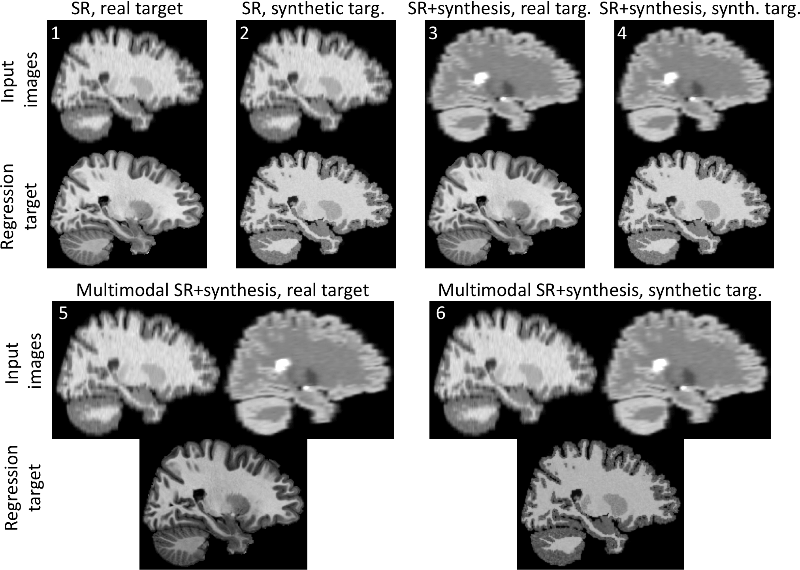

# SynthSR

This repository contains code to train a Convolutional Neural Network for Super-resolution (SR), or joint SR and data 
synthesis (i.e. domain adaptation). The network takes synthetic scans as inputs, and can be trained to either regress 
real or synthetic target scans. The synthetic scans are obtained by sampling a generative model building on the 
**[SynthSeg](https://github.com/BBillot/SynthSeg)** [1] package, which we really encourage you to have a look at!

\
In short, synthetic scans are generated at each mini-batch by: 1) randomly selecting a label map among of pool of 
training segmentations, 2) spatially deforming it in 3D, 3) sampling a Gaussian Mixture Model (GMM) conditioned on the 
deformed label map (see Figure 1 below). This gives us a synthetic scan at high resolution (HR). We then simulate thick 
slice spacing by blurring and downsampling it to low resolution (LR). In SR, we then train a network to learn the 
mapping between LR and HR synthetic scans. If real images are available along with the training label maps, we can learn
to regress the real images instead (joint SR and synthesis).

\

Figure 1: overview of SynthSR

----------------

### Tutorials for Generation and Training

This repository contains code to train your own network for SR or joint SR and synthesis. Because the training function
has a lot of options, we provide here some tutorials to familiarise yourself with the different
training/generation parameters. We emphasise that we provide example training data along with these scripts: 5 
preprocessed publicly available T1 scans at 1mm isotropic resolution [2] with corresponding label maps obtained with 
FreeSurfer [3]. The tutorials can be found in [scripts](scripts/tutorials), and they include:

- 6 generation scripts corresponding to different use cases (see Figure 2 below). We recommend to go through them all, 
(even if you're only interested in case 1), since we successively introduce different functionalities as we go through.

- 1 training script, explaining the main training parameters.

- 1 script explaining how to estimate the parameters governing the GMM, in case you wish to train a model on your own 
data.

\

Figure 2: Examples generated by running the tutorials on the provided data [2]. For each use case, we show the synhtetic 
images used as inputs to the network, as well as the regression target.

----------------

### Content

- [SynthSR](SynthSR): this is the main folder containing the generative model and training function:

  - [labels_to_image_model.py](SynthSR/labels_to_image_model.py): builds the generative model.
  
  - [brain_generator.py](SynthSR/brain_generator.py): contains the class `BrainGenerator`, which is a wrapper around 
  the model. New images can simply be generated by instantiating an object of this class, and call the 
  method `generate_image()`.
  
  - [model_inputs.py](SynthSR/model_inputs.py): prepares the inputs of the generative model.
  
  - [training.py](SynthSR/training.py): contains the function to train the network. All training 
  parameters are explained there.
  
  - [metrics_model.py](SynthSR/metrics_model.py): contains a keras model that implements diffrent loss functions.
  
  - [estimate_priors.py](SynthSR/estimate_priors.py): contains functions to estimate the prior distributions of the GMM
  parameters.
 
- [data](data): this folder contains the data for the tutorials (T1 scans [2], corresponding FreeSurfer segmentations 
and some useful files)
 
- [script](scripts): additionally to the tutorials, we also provide a script to launch trainings from the terminal

- [ext](ext): contains external packages.

----------------

### Requirements
 
This code relies on several external packages (already included in `\ext`):

- [lab2im](https://github.com/BBillot/lab2im): contains functions for data augmentation, and a simple version of 
 the generative model, on which we build to build `label_to_image_model` [1]
 
- [neuron](https://github.com/adalca/neuron): contains functions for deforming, and resizing tensors, as well as 
functions to build the segmentation network [4,5].

- [pytool-lib](https://github.com/adalca/pytools-lib): library required by the *neuron* package.

All the other requirements are listed in requirements.txt. We list here the important dependencies:

- tensorflow-gpu 2.0
- tensorflow_probability 0.8
- keras > 2.0
- cuda 10.0 (required by tensorflow)
- cudnn 7.0
- nibabel
- numpy, scipy, sklearn, tqdm, pillow, matplotlib, ipython, ...

----------------

### Citation/Contact

This repository contains the code related to a submission that is still under review.

If you have any question regarding the usage of this code, or any suggestions to improve it you can contact us at: \
e.iglesias@ucl.ac.uk

----------------

### References

[1] *[A Learning Strategy for Contrast-agnostic MRI Segmentation](http://proceedings.mlr.press/v121/billot20a.html)* \
Benjamin Billot, Douglas N. Greve, Koen Van Leemput, Bruce Fischl, Juan Eugenio Iglesias*, Adrian V. Dalca* \
*contributed equally \
MIDL 2020

[2] *[A novel in vivo atlas of human hippocampal subfields usinghigh-resolution 3 T magnetic resonance imaging](https://www.sciencedirect.com/science/article/abs/pii/S1053811913001237)* \
J. Winterburn, J. Pruessner, S. Chavez, M. Schira, N. Lobaugh, A. Voineskos, M. Chakravarty \
NeuroImage (2013)

[3] *[FreeSurfer](https://www.sciencedirect.com/science/article/abs/pii/S1053811912000389?via%3Dihub)* \
Bruce Fischl \
NeuroImage (2012)

[4] *[Anatomical Priors in Convolutional Networks for Unsupervised Biomedical Segmentation](http://www.mit.edu/~adalca/files/papers/cvpr2018_priors.pdf)* \
Adrian V. Dalca, John Guttag, Mert R. Sabuncu \
CVPR 2018

[5] *[Unsupervised Data Imputation via Variational Inference of Deep Subspaces](https://arxiv.org/abs/1903.03503)* \
Adrian V. Dalca, John Guttag, Mert R. Sabuncu \
Arxiv preprint (2019)
